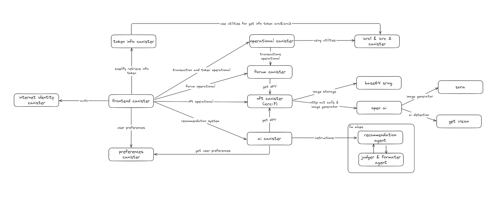

# Presentation
We're suggesting to you to read the power point and watch video to better understanding about our products.

Power Point: [PowerPoints](https://www.figma.com/slides/mH7sUwO1O5SNGH1NeXvPhp/Pitch-Deck-PiCO)  <br/>
Video Demo: [Demo Link](https://youtu.be/skKyzt4q8SQ)

# PICO
Pico is a social media platform and NFT marketplace designed to empower artists in this rapidly evolving landscape by prioritizing authorship, authenticity, and transparency.

We’re building a creative space where artists can share, mint, and connectwithout the fear of being miscredited or lost in the noise of untagged AI content.


# Background
Artists put a lot of time into their work. But the moment it hits social media, "boom" everything’s gone. No name, no credit, no copyright. People just repost it like it’s theirs. And that’s messed up.

According to a report by IPTC, around 93% of images online have their metadata stripped. Platforms like Twitter remove 100% of it. Instagram and Facebook wipe out about 85 - 90%. So even if you create something amazing, once it’s out there, no one knows it’s yours.

That’s why we built PiCO, a platform where your art stays yours. It keeps the name, the proof, and the credit, whether it's AI-generated, hand-drawn, or anything in between. And yeah, if you want, you can mint it as an NFT. But more importantly, your name stays with your work. Always.

# Tech stacks & Features Implementation
- Frontend: 
  - React — Component-based UI development
  - Vite — Fast build tool and development server
  - React Context — Simple and effective global state management
  - React Query — Robust data fetching and caching
  - Layered Services Architecture — Clear separation between UI, business logic, and services
  - pico_frontend — Main frontend application connected to backend contract

- Backend:
  - Motoko — Core language for Internet Computer smart contracts
  - OpenAI Integration — Used via HTTP outcalls for AI-driven features (text and media)
  - Cloudflare R2 — Store object and media
  - Internet Identity — Web3 Authentication
  - World HTTP Outcalls — Enables canisters to call external services like OpenAI and Sora
  - Decentralized AI with LLM Canister (Ollama) — On-chain execution of large language models, we use as recommendation system.
  - OpenAI Sora via HTTP Outcalls — Video generation and AI reasoning capabilities directly from smart contracts
  - Token Infrastructure based on ICRC standards:
    - ICRC-1 (icrc1_ledger_canister) — Fungible token ledger for PiCO token
    - ICRC-2 (icrc2_ledger_canister) — Approval-based token transfers
    - ICRC-7 (icrc7) — NFT standard for digital identity and assets
  - 9 Smart Contracts / Canister:
    - internet_identity — Web3 authentication service
    - nft_contract — NFT minting and management (ICRC7)
    - operational_contract — Core business logic and operations, including ICRC-1 and ICRC-2 token utilities
    - token_contract — PiCO token information
    - preferences_contract — User preferences and settings
    - forums_contract — Community forums and discussions
    - ai_contract — AI-powered features and integrations
    - icrc1_ledger_canister — ICRC-1 and ICRC-2 compliant token ledger for PiCO token operations
    - pico_frontend — Frontend assets canister
  
# Features
- Admin token minting capabilities with full control over token distribution
- Manual NFT upload and minting with metadata preservation
- AI-powered text-to-image NFT generation using HTTP outcalls to Sora AI
- Automated authenticity verification for manual uploads using AI detection
- Intelligent recommendation system powered by AI algorithms
- Comprehensive NFT marketplace with buy and sell functionality via forums
- Secure Web3 authentication using Internet Identity
- Real-time PICO token balance checking and monitoring
- Seamless NFT upload directly to community forums
- Interactive forum engagement with like and reaction systems
- Threaded comment system for community discussions
- Comprehensive user profiles showcasing NFT collections and forum activity
- Flexible token top-up system for enhanced platform participation
- Advanced explore page with latest posts and AI-driven content recommendations
- Complete transaction history tracking for all marketplace activities
- Detailed forum interaction history and engagement analytics
- Personalized wishlist functionality based on user likes and preferences
- Automatic NFT labeling system that identifies and tags whether content was AI-generated or manually created


# Architecture Diagram


The PiCO platform follows a modular, decentralized architecture built on the Internet Computer Protocol (ICP). The system consists of 9 interconnected smart contracts (canisters) that work together to provide a comprehensive NFT marketplace and community platform.

## Architecture Overview

### Frontend Layer
- **pico_frontend**: React-based web application serving as the user interface
- **Internet Identity**: Decentralized authentication system for Web3 login

### Core Business Logic Layer
- **operational_contract**: Central hub managing business operations, token top-ups, NFT transactions, etc. This contract utilizes ICRC-1 and ICRC-2 approval ledger utilities
- **nft_contract**: ICRC-7 compliant NFT management with minting, metadata, and ownership tracking. Integrates with external AI services for automated content generation and authenticity verification
- **forums_contract**: Community engagement platform with posts, comments, likes, and marketplace functionality

### Token Infrastructure Layer
- **icrc1_ledger_canister**: ICRC-1/ICRC-2 compliant ledger for PiCO token operations
- **token_contract**: Simplifier Token metadata and information management

### User & AI Services Layer
- **preferences_contract**: User settings and personalization data
- **ai_contract**: AI-powered features using Ollama for intelligent recommendation systems. The contract employs two specialized agents: a recommendation agent that analyzes user preferences and behavior patterns, and a formatter/judge agent that structures responses into appropriate formats (JSON, arrays) for frontend consumption.

### External Integrations
- **OpenAI/Sora API**: Text-to-image generation and AI reasoning via HTTP outcalls
- **GPT Vision**: AI-powered authenticity detection to determine if uploaded images are AI-generated or human-created, ensuring honest user submissions
- **Base64 Encoding**: On-chain media storage for NFT assets using base64 string encoding
- **LLM Canister (Ollama)**: On-chain AI processing for recommendation systems

This architecture ensures scalability, security, and true decentralization while maintaining seamless user experience.


# How to run/develop locally
1. Generate Canister ID for contracts
    ```
    dfx canister create --all
    ```
    Output:
    ```
    ai_contract canister created with canister id: uxrrr-q7777-77774-qaaaq-cai
    forums_contract canister created with canister id: u6s2n-gx777-77774-qaaba-cai
    icrc1_ledger_canister canister created with canister id: uzt4z-lp777-77774-qaabq-cai
    internet_identity canister created with canister id: rdmx6-jaaaa-aaaaa-aaadq-cai
    nft_contract canister created with canister id: umunu-kh777-77774-qaaca-cai
    operational_contract canister created with canister id: ulvla-h7777-77774-qaacq-cai
    pico_frontend canister created with canister id: ucwa4-rx777-77774-qaada-cai
    preferences_contract canister created with canister id: ufxgi-4p777-77774-qaadq-cai
    token_contract canister created with canister id: vizcg-th777-77774-qaaea-cai
    ```

2. Change variable canister inside `config.mo` by replace it from above output
    ```
    public let INTERNET_IDENTITY_CANISTER = "rdmx6-jaaaa-aaaaa-aaadq-cai";
    public let NFT_CONTRACT_CANISTER = "umunu-kh777-77774-qaaca-cai";
    public let OPERATIONAL_CONTRACT_CANISTER = "ulvla-h7777-77774-qaacq-cai";
    public let TOKEN_CONTRACT_CANISTER = "vizcg-th777-77774-qaaea-cai";
    public let PREFERENCES_CONTRACT_CANISTER = "ufxgi-4p777-77774-qaadq-cai";
    public let FORUMS_CONTRACT_CANISTER = "u6s2n-gx777-77774-qaaba-cai";
    public let ICRC1_LEDGER_CANISTER = "uzt4z-lp777-77774-qaabq-cai";
    public let PICO_FRONTEND_CANISTER = "ucwa4-rx777-77774-qaada-cai";
    public let AI_CONTRACT_CANISTER = "uxrrr-q7777-77774-qaaaq-cai";
    ```
3. Change `"init_art"` in `dfx.json`
    ```
    "icrc1_ledger_canister": {
          "type": "custom",
          "candid": "icrc1_ledger.did",
          "wasm": "icrc1_ledger.wasm.gz",
          "init_arg": "(variant { Init = record { token_symbol = \"PiCO\"; token_name = \"PiCO\"; minting_account = record { owner = principal \"umunu-kh777-77774-qaaca-cai\" }; transfer_fee = 10_000; metadata = vec {}; feature_flags = opt record { icrc2 = true }; initial_balances = vec { record { record { owner = principal \"umunu-kh777-77774-qaaca-cai\" }; 100_000_000_000_000 } }; archive_options = record { num_blocks_to_archive = 1000; trigger_threshold = 2000; controller_id = principal \"igjqa-zhtmo-qhppn-eh7lt-5viq5-4e5qj-lhl7n-qd2fz-2yzx2-oczyc-tqe\"; cycles_for_archive_creation = opt 10_000_000_000_000 } } })"
        }
    ```
- Change minting_account owner principal using operational_contract canister id
    ```
    minting_account = record { owner = principal \"{OPERATIONAL_CONTRACT_CANISTER_ID}\" }
    ```
- Change initial balances & controller ID by principal that you want.
    ```
    initial_balances = vec { record { record { owner = principal \"{YOUR_INIT_BALANCE_PRINCIPAL_ID}" }; 100_000_000_000_000 } }; archive_options = record { num_blocks_to_archive = 1000; trigger_threshold = 2000; controller_id = principal \"{YOUR_PRINCIPAL_CONTROLLER_ID}"
    ```
4. Install node modules first:
```npm install```
4.  Deploy it by running this:
```dfx deploy```
5. You will get canister UI Backend & Frontend <br/>
  `Example:`
    ```
    Deployed canisters.
    URLs:
      Frontend canister via browser:
        pico_frontend:
          - http://ucwa4-rx777-77774-qaada-cai.localhost:4943/ (Recommended)
          - http://127.0.0.1:4943/?canisterId=ucwa4-rx777-77774-qaada-cai (Legacy)
      Backend canister via Candid interface:
        ai_contract: http://127.0.0.1:4943/?canisterId=vpyes-67777-77774-qaaeq-cai&id=uxrrr-q7777-77774-qaaaq-cai
        forums_contract: http://127.0.0.1:4943/?canisterId=vpyes-67777-77774-qaaeq-cai&id=u6s2n-gx777-77774-qaaba-cai
        icrc1_ledger_canister: http://127.0.0.1:4943/?canisterId=vpyes-67777-77774-qaaeq-cai&id=uzt4z-lp777-77774-qaabq-cai
        internet_identity: http://127.0.0.1:4943/?canisterId=vpyes-67777-77774-qaaeq-cai&id=rdmx6-jaaaa-aaaaa-aaadq-cai
        nft_contract: http://127.0.0.1:4943/?canisterId=vpyes-67777-77774-qaaeq-cai&id=umunu-kh777-77774-qaaca-cai
        operational_contract: http://127.0.0.1:4943/?canisterId=vpyes-67777-77774-qaaeq-cai&id=ulvla-h7777-77774-qaacq-cai
        preferences_contract: http://127.0.0.1:4943/?canisterId=vpyes-67777-77774-qaaeq-cai&id=ufxgi-4p777-77774-qaadq-cai
        token_contract: http://127.0.0.1:4943/?canisterId=vpyes-67777-77774-qaaeq-cai&id=vizcg-th777-77774-qaaea-cai
    ```
- You can open the backend canister to try the functions.
- You can open frontend from here as well.

6. If you want `hot reload` frontend development, you can run this on terminal
    ```
    npm run start
    ```
7. Open localhost that show up in terminal, example: `localhost:3000`
    ```
    4:30:43 AM [vite] (client) Re-optimizing dependencies because lockfile has changed

      VITE v6.3.5  ready in 676 ms

      ➜  Local:   http://localhost:3000/
      ➜  Network: use --host to expose
      ➜  press h + enter to show help
    ```

# Requirements to Run applications
- Node JS > 18.0
- ICP

# Deployed Canisters
Deployed mainnet canisters.

URLs:

  Frontend canister via browser:
  
  - pico_frontend: https://eueyk-uiaaa-aaaap-qp4la-cai.icp0.io/

  Backend canister via Candid interface:

  - ai_contract: https://a4gq6-oaaaa-aaaab-qaa4q-cai.raw.icp0.io/?id=ebdjh-vaaaa-aaaap-qp4iq-cai
  - forums_contract: https://a4gq6-oaaaa-aaaab-qaa4q-cai.raw.icp0.io/?id=eiac3-diaaa-aaaap-qp4ja-cai
  - icrc1_ledger_canister: https://a4gq6-oaaaa-aaaab-qaa4q-cai.raw.icp0.io/?id=epbep-oqaaa-aaaap-qp4jq-cai
  - nft_contract: https://a4gq6-oaaaa-aaaab-qaa4q-cai.raw.icp0.io/?id=e2gvc-pyaaa-aaaap-qp4ka-cai
  - operational_contract: https://a4gq6-oaaaa-aaaab-qaa4q-cai.raw.icp0.io/?id=e5htw-caaaa-aaaap-qp4kq-cai
  - preferences_contract: https://a4gq6-oaaaa-aaaab-qaa4q-cai.raw.icp0.io/?id=etf66-zqaaa-aaaap-qp4lq-cai
  - token_contract: https://a4gq6-oaaaa-aaaab-qaa4q-cai.raw.icp0.io/?id=f6l2q-wyaaa-aaaap-qp4ma-cai

# Need to Fix!
1. Because of the problem with multiple HTTP outcals to OpenAI API on canister is limited, we still use a mock to generate AI images and detect AI images uploaded by user. We need to deploy our own backend server that call OpenAI API to fix this issue.
```
index-C98JAHCv.js:482 AI generation failed: ApiError: HTTP request failed: No consensus could be reached. Replicas had different responses. Details: request_id: 300266, timeout: 1751208855866594028, hashes: [c2f25536c190cf57c47facc4c061dab0594847bf0cd7ae24ece8c1f837e26141: 1], [a3024b568b787f998fc53535484e27747c7405d8373543ea365c348d3e63cf46: 1], [9941f9e356d4858f5ec52c8ba118b3addc784c2139d5b570bd89bd06be6faee8: 1], [6923568c5482c792fabe97e57ae6b5174596c07661ee14cbf444b0aff1baeacb: 1], [626a6c3ea32f555b35302e4b4de72514a0547686570d2a98a0f06191dc837a01: 1], [57fa7e05b431edc5b043cb138d93b790ada3a36bb232ea5dc90261ab6d82f81a: 1], [34f24edfdaab6e1b4dcc4e5da79db2eae2afa7740857c819b3a2a6d7367bd2a0: 1]
    at M5.handleResult (index-C98JAHCv.js:98:15340)
    at M5.generateAIImage (index-C98JAHCv.js:98:27007)
    at async Object.mutationFn (index-C98JAHCv.js:482:19186)
```


# Team Participants
1. Fajar Muhammad Hamka
    - Github: https://github.com/fajartd02
2. Natasya Felicia Malonda
    - Github: https://github.com/tasyafelcia
3. Pelangi Savana Puspa Romadoni
    - Github: https://github.com/pelangiromadoni
4. Stanislaus Kanaya Jerry Febriano
    - Github: https://github.com/yoshikazuuu
5. Reynaldo Marchell Bagas Adji
    - Github: https://github.com/reynaldomarchell
